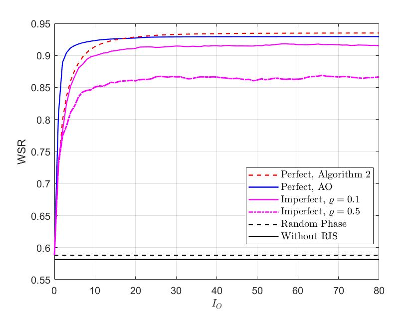

## WSR maximization for RIS system

This repository contains the source codes of the Fig.4(b) in the paper ``Weighted Sum-Rate Maximization for Reconfigurable Intelligent Surface Aided Wireless Networks'' published in IEEE Transactions on Wireless Communications.

## Introduction of the codes

### Plot fig.4(b)

Run the file ``converge_plot.m''. You may get the following figure

### Generate random channel

To generate one snapshot for simulation, one may run following three files in sequence：

+ ``generate_location.m'': Random the users' locations
+ ``generate_pathloss.m'': Calucate the pathloss according to the locations
+ ``generate_channel.m''" Randomly generate the channel realizations

### Main codes for the algorithms

The following are the main code files for the 5 algorihtms shown in the figure.

+ ``without_RIS.m'': There's no RIS in the system.
+ ``RIS_phaserand.m'': The RIS adopts random phase.
+ ``converge_AO_perfect.m'': Alternating optimization approach illustrated in Section III. Note that, to support the Riemannian conjugate gradient (RCG) algorithm, one should download the Manopt toolbox from <https://www.manopt.org/> at first.
+ ``converge_A2_perfect.m'': Proposed algorithm under the perfect CSI setup.
+ ``converge_A2_imperfect.m'': Proposed algorithm under the imperfect CSI setup.

## Note
You may cite us by  
@ARTICLE{8982186,   
author={H. Guo and Y.-C. Liang and J. Chen and E. G. Larsson},   
journal={IEEE Trans. Wireless Commun.},   
title={Weighted Sum-Rate Maximization for Reconfigurable Intelligent Surface Aided Wireless Networks},   
volume = {19},
number = {5},
pages = {3064-3076},
ISSN = {1558-2248},
DOI = {10.1109/TWC.2020.2970061},
year = {2020},
type = {Journal Article}
}

One previous version of this paper is named ``Weighted Sum-Rate Optimization for Intelligent Reflecting Surface Enhanced Wireless Networks'', which can be found in ArXiv as well (see <https://arxiv.org/abs/1905.07920>). The short version has been presented in IEEE GLOBECOM 2019.

